# System Architecture & Technical Documentation

## 1. System Overview

### High-Level Purpose
The **DSA Mentor Worker** is a background worker service designed to empower competitive programming mentors by automating the tracking, aggregation, and analysis of mentee activity across online judge platforms (**Codeforces**, **AtCoder**, and **LeetCode**). 

The application solves the problem of fragmented user progress data by regularly fetching user submission histories, contest rankings, and platform statistics. It normalizes this data into unified models, computes activity heatmaps and consecutive daily streaks, auto-completes mentor-assigned problem tasks upon detection of successful solutions, and provides an administrative interface for user lifecycle operations.

### Core Design Pattern
The worker leverages a **Layered Architecture & Scheduled Worker Pattern**:
* **API / Routing Layer (Express):** Exposes lightweight HTTP endpoints for triggerable jobs (manual syncs, stale user refreshes, handle changes, administrative tasks, metadata resolution).
* **Job / Pipeline Orchestration Layer:** Executes multi-step workflows sequentially to handle platform data syncs, contest ingestion, daily activity aggregation, streak calculation, and assignment auto-completion.
* **Service / Integration Layer:** Integrates directly with third-party external APIs (Codeforces REST API, AtCoder / Kenkoooo API, LeetCode GraphQL API) using custom HTTP client wrappers with rate limiting, serial queuing, and exponential backoff.
* **Repository Layer:** Encapsulates data access interactions with Supabase (PostgreSQL) using the service-role client to bypass Row Level Security (RLS) for worker-level persistence.

---

## 2. Technology Stack & Dependencies

| Category | Technology / Library | Purpose in this Project |
| :--- | :--- | :--- |
| **Language & Runtime** | TypeScript / Node.js (v20) | Execution environment and static type safety |
| **Runtime Execution** | `tsx` / `nodemon` | Development and production execution engine |
| **Web Framework** | Express v5 (`express`) | HTTP routing engine for job control and query APIs |
| **Database & Client** | Supabase (`@supabase/supabase-js`) | PostgreSQL backend and service-role database client |
| **Job Scheduler** | `node-cron` | In-memory recurring cron engine for scheduled user refreshes |
| **HTTP & Web Scraping** | Axios (`axios`), Cheerio (`cheerio`) | Polled API calls and HTML parsing for fallback problem metadata scraping |
| **Utilities & Helpers** | `dotenv`, `cors` | Cross-Origin Resource Sharing handling and environment management |

---

## 3. High-Level Architecture Diagram

```mermaid
flowchart TD
    subgraph External Clients & Triggers
        Cron['Node-Cron Scheduler (refreshCron)']
        AdminClient['Mentor Frontend / Admin Callers']
    end

    subgraph API & Route Layer
        Index['Express App Server (index.ts)']
        RefreshRoute['/refresh Routes']
        ProblemMetaRoute['/problem-meta Routes']
        UserHeatmapRoute['/user-heatmap Routes']
        AdminRoute['/admin Routes']
    end

    subgraph Job Pipelines & Workflows
        Pipeline['Refresh Pipeline (runFullRefreshForUser)']
        ProblemSync['Problem Solved Sync (problemSolved)']
        ContestSync['Contest Sync (contestRefresh)']
        DailyCountSync['Daily Count Compute (dailyCount)']
        StreakSync['Streak Compute (streak)']
        AssignmentSync['Assignment Auto-Complete (assignmentSync)']
        HandleChangeSync['Handle Change Resync (handleChange)']
    end

    subgraph Service Layer & Clients
        CFClient['Codeforces Client']
        ATCClient['AtCoder Client']
        LCClient['LeetCode Client']
        MetaService['Problem Metadata Resolver']
        HTTPClient['Polite Throttled HTTP Client']
    end

    subgraph Storage Layer
        DB[(Supabase PostgreSQL)]
    end

    subgraph External Platforms
        CFAPI['Codeforces API']
        ATCAPI['AtCoder / Kenkoooo API']
        LCAPI['LeetCode GraphQL API']
    end

    Cron --> Pipeline
    AdminClient --> Index
    Index --> RefreshRoute & ProblemMetaRoute & UserHeatmapRoute & AdminRoute

    RefreshRoute --> Pipeline & HandleChangeSync
    ProblemMetaRoute --> MetaService
    UserHeatmapRoute --> DB
    AdminRoute --> DB

    Pipeline --> ProblemSync
    Pipeline --> ContestSync
    Pipeline --> DailyCountSync
    Pipeline --> StreakSync
    Pipeline --> AssignmentSync

    ProblemSync --> CFClient & ATCClient & LCClient
    ContestSync --> CFClient & ATCClient & LCClient
    MetaService --> HTTPClient

    CFClient --> CFAPI
    ATCClient --> ATCAPI
    LCClient --> LCAPI
    HTTPClient --> CFAPI & ATCAPI

    ProblemSync & ContestSync & DailyCountSync & StreakSync & AssignmentSync & HandleChangeSync --> DB
```

---

## 4. Directory & Module Structure

```plaintext
dsa-mentor-worker/
├── config/
│   └── env.ts                   # Environment runtime placeholder configuration
├── db/
│   ├── supabase.ts              # Supabase client instantiation (Service-Role enabled)
│   ├── groups_notes_schema.sql  # SQL definitions for mentee groups and mentor notes
│   ├── mentorship_schema.sql    # SQL definitions for mentorships, invites, and assignments
│   └── profile_avatar_schema.sql# SQL definitions for profile avatar URL extension
├── jobs/
│   ├── assignmentSync.ts        # Auto-completes pending assignments matching solved problems
│   ├── contestRefresh.ts       # Fetches and upserts contest history across platforms
│   ├── dailyCount.ts           # Calculates and records daily newly solved problem counts
│   ├── handleChange.ts         # Handles platform handle changes (purges & resyncs history)
│   ├── problemSolved.ts        # Primary ingestion pipeline for platform solved problems
│   ├── refreshCron.ts          # node-cron task registration and execution runner
│   ├── refreshPipeline.ts      # Orchestrates full sequential refresh steps for users
│   └── streak.ts               # Implements day-by-day streak evaluation up to yesterday
├── repository/
│   ├── admin.repo.ts           # Complete user deletion across all user-scoped tables
│   ├── assignments.repo.ts     # Data access for fetching and completing mentee assignments
│   ├── dailyCount.repo.ts      # Data access for daily_count records
│   ├── problems.repo.ts        # Global problem catalog upserts and queries
│   ├── profile.repo.ts         # Fetches user lists and updates last_refreshed timestamps
│   ├── solvedProblems.repo.ts  # Fetches and inserts user solved problem logs
│   ├── streak.repo.ts          # Manages user-streak data
│   ├── userContest.repo.ts     # Upserts contest participation data
│   ├── userPlatform.repo.ts    # Reads registered platform handle associations
│   └── userPlatformData.repo.ts# Manages aggregated per-platform metrics (easy/med/hard/rating)
├── routes/
│   ├── admin.ts                # Express routes for administrative actions (delete user)
│   ├── problemMeta.ts         # Express route for resolving problem URLs into metadata
│   ├── refresh.ts              # Express routes for single, stale, handle-change, and init syncs
│   └── userHeatmap.ts          # Express route for retrieving user submission heatmaps
├── scripts/
│   ├── backfillDailyCount.ts   # Backfills historic daily_count entries for existing users
│   ├── createTestAccounts.ts   # Utility script for creating test users pre-loaded with handles
│   ├── deleteTestAccounts.ts   # Purges test users under test domain
│   ├── fixHandleInconsistencies.ts # Maintenance CLI to rebuild user platform metrics
│   ├── refreshHeatmap.ts      # Re-aggregates heatmap counts across platforms
│   └── refreshPlatformData.ts # Computes easy/medium/hard breakdown per user
├── services/
│   ├── atcoder/
│   │   └── client.ts           # AtCoder API ingestion client & contest sync
│   ├── codeforces/
│   │   └── client.ts           # Codeforces API ingestion client & contest sync
│   ├── leetcode/
│   │   └── client.ts           # LeetCode GraphQL client & submission calendar solver
│   ├── config.ts               # Platform API URL definitions and GraphQL queries
│   ├── handleVerification.ts   # Fast single-request verification of platform handles
│   └── problemMeta.ts          # Multi-platform problem URL parser and meta scraper
├── types/
│   ├── db.ts                   # Supabase Database schema type definitions
│   ├── platformResponse.ts     # Interfaces for third-party platform API payloads
│   └── response.ts             # Standardized internal return structures
├── utils/
│   ├── dbHelper.ts             # De-duplication and mapping helper functions
│   ├── difficulty.ts           # Numerical rating to difficulty string classifier
│   ├── httpClient.ts           # Throttled, queued HTTP client with exponential backoff
│   └── problemUrl.ts           # RegEx parser for problem URL canonicalization
├── index.ts                    # Server application entry point
├── package.json                # Project dependencies and script definitions
└── tsconfig.json               # TypeScript compiler configuration
```

---

## 5. Data Models & Database Schema

```mermaid
erDiagram
    profile {
        uuid user_id PK
        text name
        text description
        boolean onboarding_completed
        timestamptz last_refreshed
        text avatar_url
    }

    user_platforms {
        uuid user_id FK
        text platform PK
        text handle PK
    }

    problems {
        text problem_id PK
        text platform
        text title
        text difficulty
        integer rating
        text_array tags
    }

    solved_problems {
        uuid user_id FK
        text platform
        text problem_id FK
        timestamptz solved_at
        boolean already_solved
        text solved_date
    }

    user_contest {
        uuid user_id FK
        text platform PK
        text contest_id PK
        timestamptz date
        integer rank
        integer rating
    }

    user_platform_data {
        uuid id PK
        uuid user_id FK
        text platform
        integer solved_count
        integer easy
        integer medium
        integer hard
        integer rating
        integer max_rating
        timestamptz updated_at
    }

    daily_count {
        uuid user_id FK
        text date PK
        integer solved
    }

    user_streak {
        uuid user_id PK
        integer curr_streak
        integer longest_streak
        text updated_on
    }

    assignments {
        uuid id PK
        uuid mentor_id FK
        uuid mentee_id FK
        text platform
        text problem_id FK
        text title
        text url
        text note
        date due_date
        text status
        timestamptz assigned_at
        timestamptz completed_at
        text completed_via
    }

    mentorships {
        uuid id PK
        uuid mentor_id FK
        uuid mentee_id FK
        text status
        timestamptz created_at
    }

    invites {
        uuid id PK
        uuid mentor_id FK
        citext invitee_email
        uuid invitee_user_id FK
        uuid token
        text status
        timestamptz created_at
        timestamptz expires_at
        timestamptz responded_at
    }

    mentee_groups {
        uuid id PK
        uuid mentor_id FK
        text name
        timestamptz created_at
    }

    mentee_group_members {
        uuid group_id PK
        uuid mentee_id PK
        timestamptz added_at
    }

    mentor_notes {
        uuid id PK
        uuid mentor_id FK
        uuid mentee_id FK
        text body
        timestamptz created_at
    }

    profile ||--o{ user_platforms : "configures"
    profile ||--o{ solved_problems : "logs"
    profile ||--o{ user_contest : "participates"
    profile ||--o{ user_platform_data : "summarizes"
    profile ||--o{ daily_count : "tracks"
    profile ||--o| user_streak : "maintains"
    profile ||--o{ assignments : "receives_or_creates"
    profile ||--o{ mentorships : "mentors_or_menteed"
    profile ||--o{ invites : "sends_or_receives"
    profile ||--o{ mentee_groups : "owns"
    profile ||--o{ mentor_notes : "authors_or_receives"
    problems ||--o{ solved_problems : "references"
    problems ||--o{ assignments : "assigned_in"
    mentee_groups ||--o{ mentee_group_members : "contains"
```



---

## 6. API Surface, Routes & Interfaces

| Method | Endpoint / Route | Controller / Handler | Auth Required | Description |
| :--- | :--- | :--- | :--- | :--- |
| **GET** | `/` | Anonymous Inline Handler | No | Service healthcheck verification route |
| **GET** | `/user-heatmap` | `userHeatmapRouter` | No | Retrieves past year daily submission count dictionary for given `user_id` query |
| **POST** | `/refresh/user` | `refreshRouter` | Service Key | Triggers full end-to-end sync pipeline for a single `user_id` |
| **POST** | `/refresh/stale` | `refreshRouter` | Service Key | Finds all users refreshed >24h ago (or null) and runs pipeline sequentially |
| **POST** | `/refresh/handle-change` | `refreshRouter` | Service Key | Purges platform-scoped history for altered platforms and triggers full rebuild |
| **POST** | `/refresh/fresh-init` | `refreshRouter` | Service Key | Verifies handles instantly, responds 200/422, then launches historical import in background |
| **GET** | `/problem-meta` | `problemMetaRouter` | Service Key | Resolves problem URL into canonical title, tags, and difficulty, upserting to catalog |
| **POST** | `/admin/delete-user` | `adminRouter` | Service Key | Irreversibly deletes user across all 13 user-scoped tables and Supabase Auth |

---

## 7. Key Data Flows & Sequences

### User Full Refresh Pipeline
This sequence illustrates the processing flow when `runFullRefreshForUser(user_id)` is triggered (via Cron, API request, or after handle onboarding).

```mermaid
sequenceDiagram
    autonumber
    actor Trigger as Cron / API Route
    participant Pipeline as refreshPipeline
    participant SolvedJob as problemSolved Job
    participant ContestJob as contestRefresh Job
    participant DailyJob as dailyCount Job
    participant StreakJob as streak Job
    participant AssignJob as assignmentSync Job
    participant ThirdParty as External Platforms (CF/ATC/LC)
    participant DB as Supabase DB

    Trigger->>Pipeline: runFullRefreshForUser(user_id)
    
    rect rgb(235, 245, 255)
        Note over Pipeline,ThirdParty: Step 1: Platform Problem Ingestion
        Pipeline->>SolvedJob: refreshUser(user_id)
        SolvedJob->>DB: getUserPlatforms(user_id)
        DB-->>SolvedJob: { platform: handle }